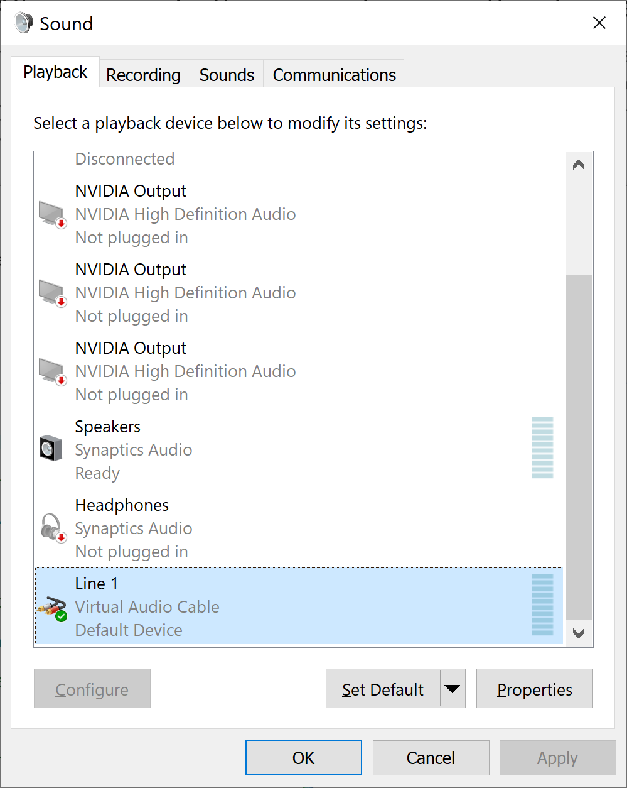
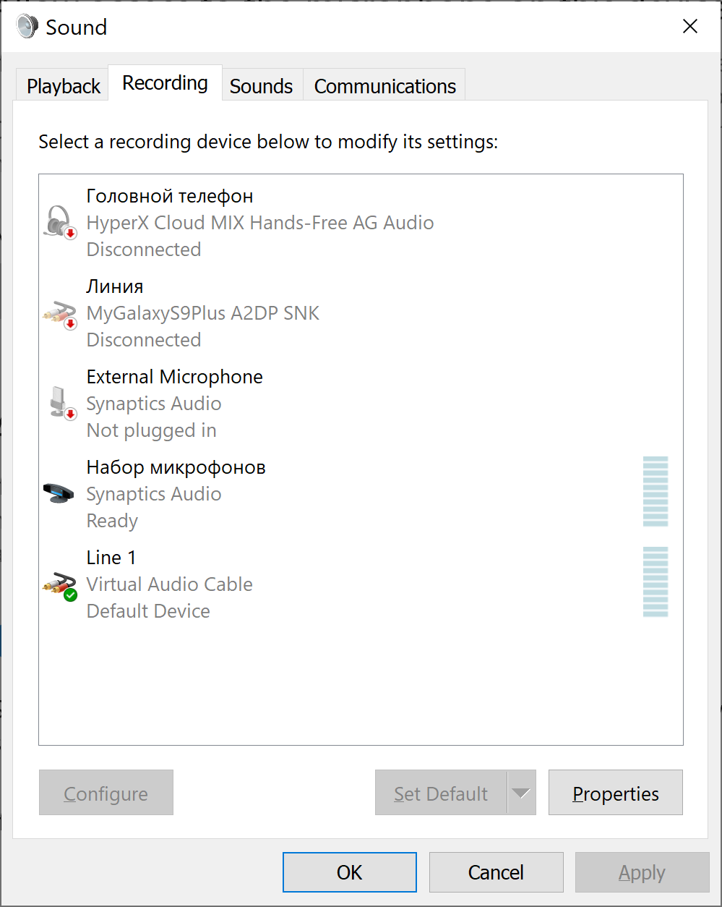
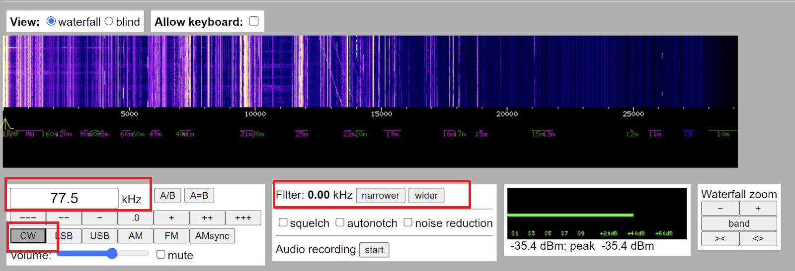

# Time Signals Decoder
This is the simple example which show how to decode DCF77 time signal from the wave file and in real time from [WebSDR](http://www.websdr.org/) or
[KiwiSDR](http://kiwisdr.com/public/) sources.

Tested on Python 3.11.4 on Windows 10

The program assumes that you have already installed [soundfile](https://pypi.org/project/soundfile/), [sounddevice](https://pypi.org/project/sounddevice/),
[numpy](https://pypi.org/project/numpy/) and [scipy](https://pypi.org/project/scipy/) packages on your Python system.

To install them use the following command:
```
python -m pip install soundfile sounddevice numpy scipy
```
Also, the [Virtual Audio Cable (VAC)](https://vac.muzychenko.net/en/download.htm) must be installed and configured if you would like to decode the time signal from WebSDR or KiwiSDR sources in real time. The Light version of the VAC is suffient.
Download and install the VAC.

### Configuring VAC

To configure the VAC go to Control Panel->Sound.
On Playback tab select Line 1 as Default.

  

On Recording tab also select Line 1 as Default.



When you do not use VAC set the settings as they were before.

### Cofiguring WebSDR for DCF77
1. Select CW demodulation
2. Set width of the radio band to 0
3. Set the radio frequency to 77.5 kHz 




### Usage:

#### To view the signal plots from WebSDR:
1. Configure the VAC to transfer via the Virtual Audio Cable.
2. Go to the WebSDR site, for example [http://websdr.ewi.utwente.nl:8901/](http://websdr.ewi.utwente.nl:8901/)
   Run the application:  
```
python signal_processor.py plot -s audio-device --threshold 0.012 --sample-count=100000
```
Threshhold value must be empirically choosen to get the correct PWM (power width modulation) signal from the envelope.

To view the signal plots from samples folder:
```
python signal_processor.py plot -s file --threshold 1500 --sample-count=100000 samples/dcf_77_1.wav
```
#### To decode DCF from WebSDR:
1. Configure the VAC to transfer via the Virtual Audio Cable.
2. Goto WebSDR site, for example [http://websdr.ewi.utwente.nl:8901/](http://websdr.ewi.utwente.nl:8901/)
3. Tune the WebSDR Radio to 77.5 kHz, CW, Set widhth of the band = 0.
4. Run the application:  
```
python signal_processor.py decode-dcf77 -s audio-device --threshold 0.012
```

Threshhold value must be empirically choosen to get the correct PWM (power width modulation) signal from the envelope. If you do not see the process of decoding
of the time from the DCF77, please use plots of the signals to choose the best threshold value.
To decode the wav file from the samples folder:
```
python signal_processor.py decode-dcf77 -s file --threshold 1500 samples/dcf_77_1.wav
```
